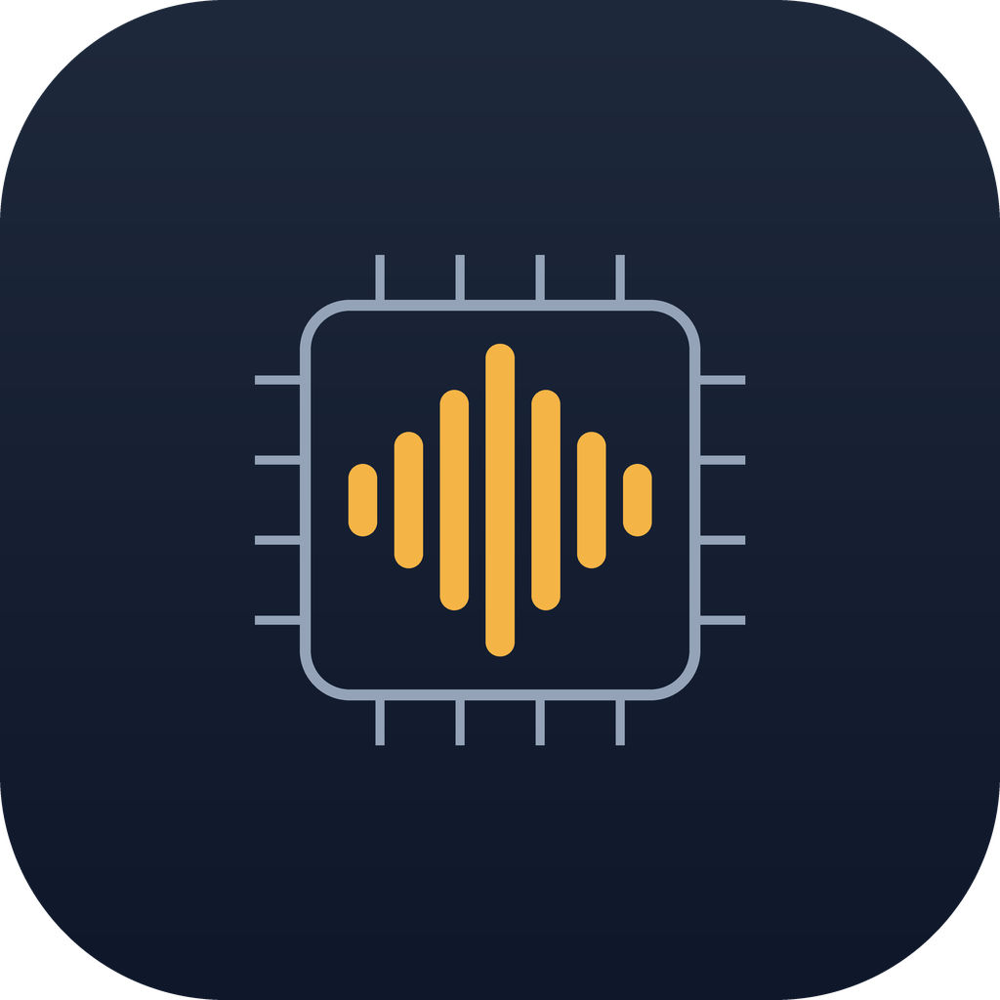

# Kobzar — локальний AI-стек з українською озвучкою

Меню-бар застосунок для macOS (Apple Silicon), що тримає **повністю офлайн** AI-робоче місце: локальні мовні моделі через **Ollama** + **українську озвучку (StyleTTS2)**. Створено й відлагоджено на **MacBook Air M2 з 8 ГБ RAM** — тобто все заточено під жорсткий ліміт пам'яті.

> Назва — від кобзаря, мандрівного співця: модель думає, голос говорить, і все це без інтернету.



## Філософія

- **Офлайн і приватно.** Жодних хмар, ключів, телеметрії. Текст не виходить за межі Mac.
- **Без автозапусків.** Жодних `launchd`/демонів/`KeepAlive`. Кожен сервіс стартуєш і **зупиняєш руками** з меню. Це свідоме рішення (раз обпеклися: фоновий демон зробив озвучку невбивною й вантажив RAM на 8 ГБ).
- **Одна модель у RAM.** На 8 ГБ немає місця під дві. Стек це поважає.

## Що вміє

**Ollama (меню-бар):** старт/стоп, список моделей, вивантаження з RAM, індикація RAM/swap (з ⚠ коли swap високий). Моделі можна тримати на зовнішньому SSD (економія внутрішнього диска). Прапори оптимізації під 8 ГБ — **тоглами прямо в налаштуваннях** (не треба правити env руками).

**Українська озвучка (StyleTTS2-UA, [patriotyk](https://huggingface.co/patriotyk)):**
- Озвучити **виділений текст** або **буфер обміну**, пауза/стоп (нативний `NSSound`).
- Виділене читається через **Accessibility API** — *без* засмічення буфера обміну. Якщо застосунок не віддає виділення через AX, фолбек — синтетичний `⌘C` з негайним відновленням попереднього буфера.
- **Глобальні хоткеї** (CGEventTap): за замовчуванням `⌃⌥` = озвучити виділене, `⌃⌥⇧` = пауза/продовжити. Перепризначаються у вікні налаштувань.
- Стан прямо в іконці меню-бару: ⏳ синтез · ♪ грає · ‖ пауза.

**Міні-чат:** легке вікно для розмови з активною Ollama-моделлю прямо з меню-бару, з опційною автоозвучкою відповіді.

## Три режими озвучки

StyleTTS2 — велика модель; на 8 ГБ один синтез довгого тексту відчутно затримує перший звук. Тому є три режими (перемикач у Налаштування → Голос):

| Режим | Як працює | Коли |
|---|---|---|
| **Базовий** | Увесь текст одним запитом, потім грає. Найстабільніший тембр. | Короткий текст, максимальна якість. |
| **Стрім** | Конвеєр: ділить на шматки, грає шматок N поки в фоні синтезується N+1. Час до першого звуку ~0.7 с замість ~3 с (≈4× швидше). | Виділене/буфер — щоб не чекати. |
| **Реалтайм** | Озвучує речення **поки модель ще пише** (ефект «живого диктора»). Подає завершені речення в чергу синтезу на льоту. | Чат — слухаєш відповідь майже одразу. |

Нюанс Реалтайму: кожне речення = окремий запит до StyleTTS2 = окремий style-вектор, тож **тембр може трохи стрибати між реченнями** — це норма для цього режиму (плата за «читати поки пише»). Виділений текст у Реалтаймі звучить рівно, бо йде через стрім-чанки (кілька речень в одному запиті, менше перемикань style).

Перед синтезом текст чиститься від **емоджі** (модель їх не читає).

### Текстова нормалізація перед синтезом

TTS-модель сама не читає цифри, абревіатури й латиницю — тож сервер їх розгортає:
- **Числа → слова:** `15` → «п'ятнадцять» (`num2words`, lang=uk).
- **Абревіатури по літерах:** `ДПА` → «де-пе-а»; відомі слова-винятки (`НАТО`, `ЮНЕСКО`…) читаються як слова.
- **Символи:** `%`, `₴`, `$`, `°`, `№`, `@`, `#`, `/`… → словами.
- **Латиниця → українська фонетика.** Англійські слова не перемикають голос на «кривий англійський» — вони **транскрибуються** в українські звуки тим самим голосом через `g2p_en` (ARPABET → укр). `I go to bed` → «ай ґоу ту бед», абревіатури по літерах (`TTS` → «ті-ті-ес»).

## Вікно налаштувань

Скляне вікно (напівпрозорість регульована) з вкладками **Загальні · Голос · Моделі · Міні-чат**:
- **Загальні:** тема, акцент, прозорість; глобальні хоткеї (комбо показані сірим стовпчиком справа); автозапуск сервісів при відкритті панелі; ліміт токенів відповіді; **тоглі оптимізації Ollama** (Flash Attention, KV-кеш 8-біт — діють при наступному старті Ollama).
- **Голос:** вибір голосу, швидкість, пауза між реченнями, режим озвучки (Базовий/Стрім/Реалтайм).
- **Моделі:** активна модель, у RAM / вивантажити / видалити, завантаження нових (Ollama library або HuggingFace GGUF), бібліотека з пошуком, папка моделей.

Вікно само міряє екран і підбирає висоту так, щоб вкладка вмістилася без скролу; на **13″/малих роздільностях** автоматично вмикається внутрішній скрол вкладки — інформація не губиться ніколи.

## Структура

```
panel/         меню-бар застосунок (rumps + pyobjc)
  panel.py        уся логіка: Ollama, TTS, RAM, хоткеї, налаштування, міні-чат
  make_icon.py    генератор іконки (Pillow → .icns)
  start-ollama.sh лаунчер Ollama (env-оптимізація з config.json) → у ~/.ollama/
tts-server/    OpenAI-сумісний TTS-сервер
  server.py       Flask :5050, POST /v1/audio/speech, StyleTTS2 на CPU
  start-tts.sh    запуск (стартує лише якщо порт вільний)
  requirements.txt
bench/         бенчмарки моделей під 8 ГБ (швидкість, ablation, vision)
```

TTS — **OpenAI-сумісний** ендпойнт, тож його видно будь-якому клієнту, що вміє `audio/speech` (Cherry Studio, скрипти тощо).

## Залежності

**TTS** (`tts-server/requirements.txt`): `torch`, `styletts2-inference`, `ipa-uk`, `ukrainian-word-stress` (усі — patriotyk), `num2words`, `g2p_en`, `flask`, `soundfile`. Перший запуск `g2p_en` тягне ресурси nltk: `averaged_perceptron_tagger_eng`, `cmudict`.

**Панель:** `rumps`, `pyobjc` (Cocoa/Quartz/ApplicationServices), `pillow`. Окремо — встановлений **Ollama** (Homebrew: `brew install ollama`).

**Голоси** StyleTTS2 (`*.pt`) у репо **не входять** — тягнути з HuggingFace (`patriotyk/styletts2_ukrainian_*`) у `voices/`.

## Запуск

```bash
# (опціонально) шлях до зовнішнього диска з моделями Ollama:
export LOCALAI_DISK="/Volumes/MyExternalSSD"

# лаунчер Ollama (панель шукає саме тут):
cp panel/start-ollama.sh ~/.ollama/start-ollama.sh && chmod +x ~/.ollama/start-ollama.sh

# TTS-сервер
bash tts-server/start-tts.sh

# панель
.venv/bin/python panel/panel.py
```

Панелі потрібен дозвіл **Accessibility** (Системні налаштування → Конфіденційність і безпека → Доступність) — для читання виділеного тексту й глобальних хоткеїв. Застосунок попросить при першому запуску; після видачі дозволу хоткеї підхоплюються без перезапуску (вбудований retry).

## Граблі розробки (нюанси, на яких підірвалися)

- **macOS 26 не малює меню-бар-іконку, якщо `.app` запускає Python через `exec`** (Apple FB21015611). Лаунчер мусить запускати python **дочірнім** процесом і робити `wait`, а не `exec`. Активаційна політика — `accessory` (1).
- **pyobjc:** кожен метод підкласу `NSObject` трактується як селектор. Чисто-пайтонівські хелпери всередині таких класів **обов'язково** мають `@objc.python_method`, інакше `BadPrototypeError`.
- **Виділення тягнуло буфер** доки `.app` не мав Accessibility: і AX-читання, і синтетичний `⌘C` мовчки фейляться без trust → читався старий буфер. Корінь — саме дозвіл, а не код.
- **StyleTTS2 venv без pip** — ставити пакети через `uv pip install --python <venv>`.
- **TTS + модель на 8 ГБ** співіснують, але синтез сповільнюється (~5с → ~9с) через своп. Це не баг, це 8 ГБ. Для уроку/демо: спершу згенеруй текст, *потім* озвучуй (або вмикай Стрім/Реалтайм для швидкого старту).
- **Реалтайм-дрейф тембру** не баг StyleTTS2-сервера, а наслідок розбиття на окремі запити (кожен — новий style-вектор). Хочеш рівний тембр — Базовий або Стрім.
- **Скрол вкладок налаштувань**: фіксовані вкладки завжди в `NSScrollView` з перевернутим clip-view (контент пришпилений до верху, скролбар автоприховується) — так висота вкладки не ріже інфо на низьких екранах.
- **Cherry «Agent mode» не працює з Ollama**: агент-режим Cherry шелл-аутить у Claude Code CLI, який не знає імен Ollama-моделей (`gemma3:4b` → «model not found»). Локальні моделі використовуй у звичайному **Chat**, не в Agent.

## Залізо й моделі (8 ГБ RAM)

Реальний бюджет під модель — **~4–5 ГБ**, тож стеля = **4B у Q4_K_M**. Перевірені ролі:

| Сценарій | Модель |
|---|---|
| Українська (тексти, уроки) | **MamayLM-Gemma-3-4B** (INSAIT) — найкращий укр 4B |
| Код / міркування / RU / мультимова | **qwen3:4b** |
| Vision (фото/скрін → текст) | **qwen3-vl:4b** |
| Швидкий чернетковий | **gemma3:1b** |
| Embeddings (RAG) | **nomic-embed-text** |
| Без цензури | **qwen3-abliterated:4b** (huihui) |

Оптимізація Ollama під 8 ГБ (`OLLAMA_FLASH_ATTENTION=1`, `OLLAMA_KV_CACHE_TYPE=q8_0`, `OLLAMA_MAX_LOADED_MODELS=1`, `OLLAMA_NUM_PARALLEL=1`, `OLLAMA_KEEP_ALIVE=5m`) і `num_ctx` ≤ 8192 у клієнті — критично, інакше своп. Перші два прапори вмикаються/вимикаються тоглами в налаштуваннях; решта зашита в `start-ollama.sh`.

## Кому легко підніметься

- **macOS Apple Silicon тільки** (rumps/pyobjc/AppKit). Не кросплатформа.
- **Ollama-частина** (меню, моделі, чат, оптимізація) — піднімається легко: `brew install ollama`, python-venv з `rumps`+`pyobjc`, скопіювати `start-ollama.sh`.
- **TTS-частина** — головний поріг: окремий StyleTTS2-UA сервер + голосові `*.pt` з HuggingFace (кілька ГБ) + nltk-ресурси. Без неї чат працює, озвучка — ні.
- **Шляхи** не зашиті: диск моделей через `LOCALAI_DISK` / UI, конфіг у `~/.local/localai-panel/`.

## Ліцензія

MIT (планується). Голосові моделі StyleTTS2 — за ліцензією їхніх авторів (patriotyk), MamayLM — Gemma terms.

---

Зроблено для себе, як офлайн-інструмент українського AI-креатора/викладача. PR і issue вітаються.
